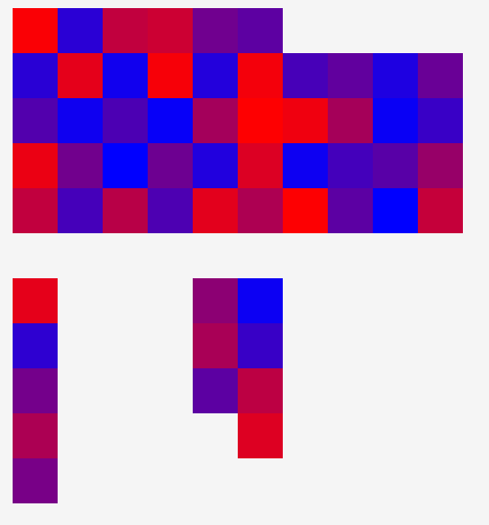
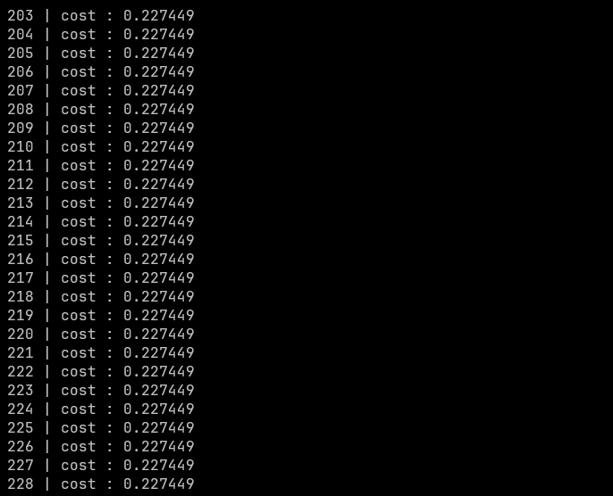
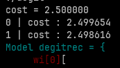
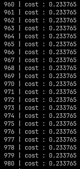

# Nero: Neural network framework written from scratch in C!!
## NERO 
Nero is a Amateur machine learning framework written from scratch in pure C i with GREAT help (aka stealing) from mister @Tsoding on Youtube !!!
## visualizing the learning process
I used the open source library Raylib to see how the values of the weights and biases change during the learning process ... you will be left with something that looks like this : 

This is still far from done , there is still much room for improvement.
## Gamma / Hadron dataset
I tried it this morning , you can see how the cost value stays fixed after a bunch of iterations , i think its because of the activation funtion sigmoid , it kinds of limit the neuron activations (for every x from R 0<sig(x)<1) 

So ill have to add more activation function and try again.
## MNIST dataset
tried running it ... am pretty sure it works however my machine is soo bad so in the matter of 5 min i got this:

i guess thats progress ? am sure a good machines from your end and more optimizations from mine will speed this up.

## Cancer detection
well am loosing my faith in this framework , seriously why is the cost stagering ? i checked like a million times ... 
 

maybe the dataset is busted ?
## Goal ?
The goal from this framework is to understand how neural network and AI work by writting your an implimentation from scratch and tinker around trying to wrape your mind around how big frameworks are made , so that when you are using them you get an deeper understanding of how they work under the hood ... and also its very cool to brag about writting your machine learing models in C.
## Using ?  
- Install the dependencies (make and libc).
- create a c file and include Nero.h .
- extract all the data that you will need. 
- define an array architecture that describes the neural network.
- define the models : the model and its gradient and init them.
- define stride (as in max rows of the data) , and the rows .
- get input and output matrixes .
- train the model
## Future Goals for Nero ? 
- More flexibility and options
- Getting a Hardware boost (Using GPUs).
- Running a language model on it.
